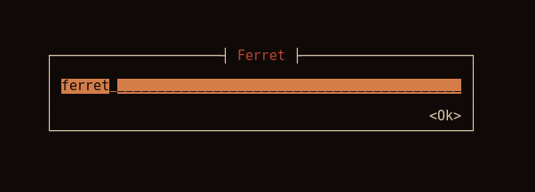
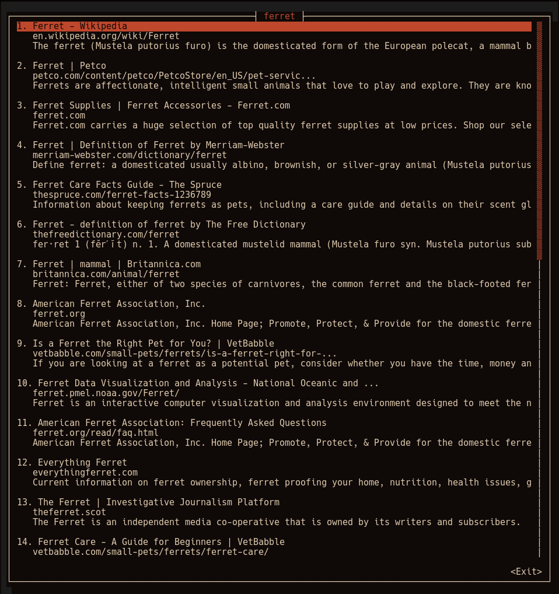
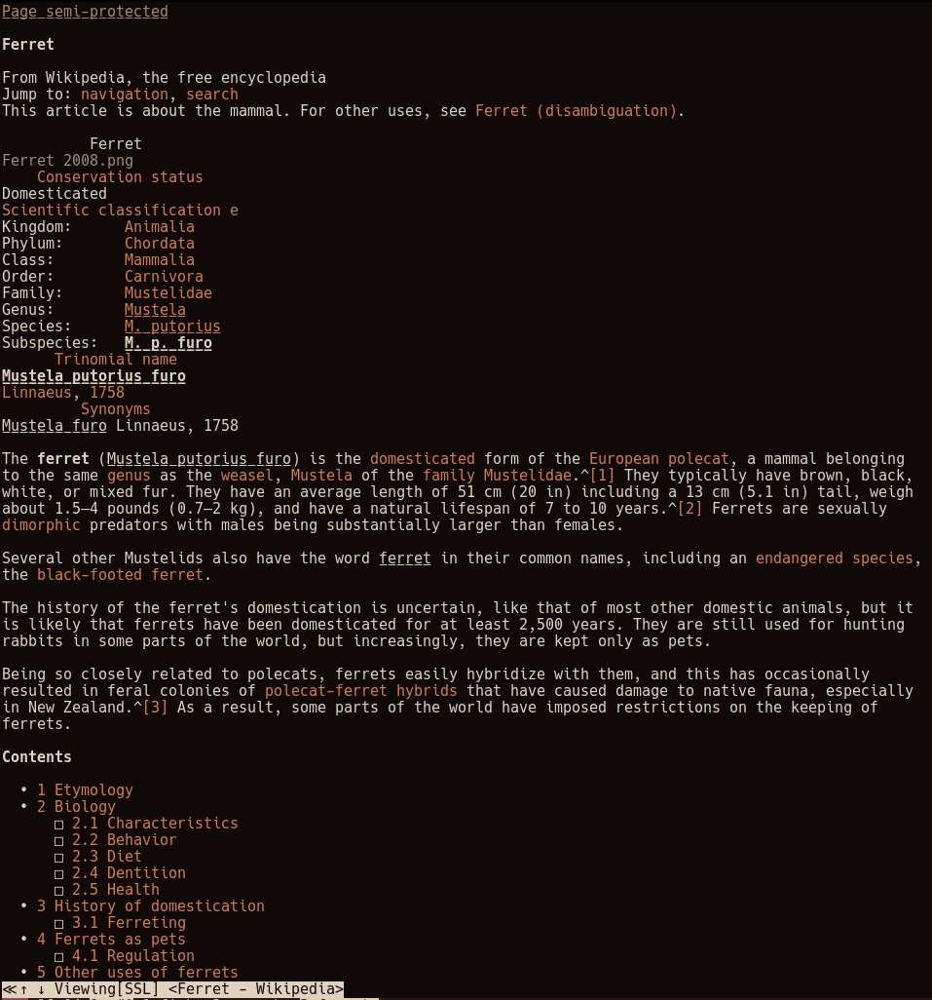

# ferret

Search DuckDuckGo in your terminal.

Run `ferret` and enter a search query:

Ferret will display the first page of results:

Press Enter on a result and it will open the result in a terminal text-based web
browser (w3m):

## Why DuckDuckGo

Not only does it respect your privacy, but they are also pretty lenient about
not blocking scrapers. Google will eventually detect scrapers and force you to
fill out a captcha.

## Bugs

There's [an issue](https://github.com/gyscos/Cursive/issues/199) with launching
a sub program in [Cursive](https://github.com/gyscos/Cursive), the Rust
terminal UI library I'm using, where keyboard input doesn't quite go through
and the cursor does not show up.

## Todo

* Allow pressing 0-9 take you to that Nth result (0 == 10)
* Allow configuring colors
* Allow configuring web browser
* Error if screen is too small
* Display DuckDuckGo instant answers
* Support other search engines
* Add search history (press up arrow to get previous search entered)
* Cache search results
* Add autocompletion
* Refactor out scraping code into a separate module from the UI code
* Add tests
